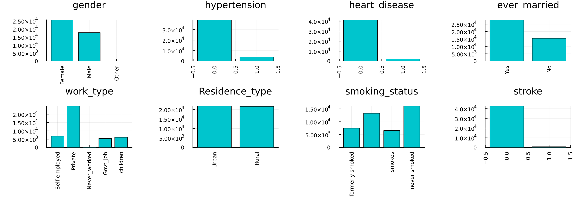

# Balanced Bagging for Cerebral Stroke Prediction


```julia
using Random
using CSV
using DataFrames
using MLJ
using Imbalance
using MLJBalancing
using StatsBase
using ScientificTypes
using Plots, Measures
using Impute
```

## Loading Data
In this example, we will consider the [Cerebral Stroke Prediction Dataset](https://www.kaggle.com/datasets/shashwatwork/cerebral-stroke-predictionimbalaced-dataset) found on Kaggle for the objective of predicting where a stroke has occured given medical features about patients.

`CSV` gives us the ability to easily read the dataset after it's downloaded as follows


```julia
df = CSV.read("../datasets/cerebral.csv", DataFrame)

# Display the first 5 rows with DataFrames
first(df, 5) |> pretty

```

    ┌───────┬─────────┬────────────┬──────────────┬───────────────┬──────────────┬──────────────┬────────────────┬───────────────────┬────────────────────────────┬──────────────────────────┬────────┐
    │ id    │ gender  │ age        │ hypertension │ heart_disease │ ever_married │ work_type    │ Residence_type │ avg_glucose_level │ bmi                        │ smoking_status           │ stroke │
    │ Int64 │ String7 │ Float64    │ Int64        │ Int64         │ String3      │ String15     │ String7        │ Float64           │ Union{Missing, Float64}    │ Union{Missing, String15} │ Int64  │
    │ Count │ Textual │ Continuous │ Count        │ Count         │ Textual      │ Textual      │ Textual        │ Continuous        │ Union{Missing, Continuous} │ Union{Missing, Textual}  │ Count  │
    ├───────┼─────────┼────────────┼──────────────┼───────────────┼──────────────┼──────────────┼────────────────┼───────────────────┼────────────────────────────┼──────────────────────────┼────────┤
    │ 30669 │ Male    │ 3.0        │ 0            │ 0             │ No           │ children     │ Rural          │ 95.12             │ 18.0                       │ missing                  │ 0      │
    │ 30468 │ Male    │ 58.0       │ 1            │ 0             │ Yes          │ Private      │ Urban          │ 87.96             │ 39.2                       │ never smoked             │ 0      │
    │ 16523 │ Female  │ 8.0        │ 0            │ 0             │ No           │ Private      │ Urban          │ 110.89            │ 17.6                       │ missing                  │ 0      │
    │ 56543 │ Female  │ 70.0       │ 0            │ 0             │ Yes          │ Private      │ Rural          │ 69.04             │ 35.9                       │ formerly smoked          │ 0      │
    │ 46136 │ Male    │ 14.0       │ 0            │ 0             │ No           │ Never_worked │ Rural          │ 161.28            │ 19.1                       │ missing                  │ 0      │
    └───────┴─────────┴────────────┴──────────────┴───────────────┴──────────────┴──────────────┴────────────────┴───────────────────┴────────────────────────────┴──────────────────────────┴────────┘


It's obvious that the `id` column is useless for predictions so we may as well drop it.


```julia
df = df[:, Not(:id)]
first(df, 5) |> pretty
```

    ┌─────────┬────────────┬──────────────┬───────────────┬──────────────┬──────────────┬────────────────┬───────────────────┬────────────────────────────┬──────────────────────────┬────────┐
    │ gender  │ age        │ hypertension │ heart_disease │ ever_married │ work_type    │ Residence_type │ avg_glucose_level │ bmi                        │ smoking_status           │ stroke │
    │ String7 │ Float64    │ Int64        │ Int64         │ String3      │ String15     │ String7        │ Float64           │ Union{Missing, Float64}    │ Union{Missing, String15} │ Int64  │
    │ Textual │ Continuous │ Count        │ Count         │ Textual      │ Textual      │ Textual        │ Continuous        │ Union{Missing, Continuous} │ Union{Missing, Textual}  │ Count  │
    ├─────────┼────────────┼──────────────┼───────────────┼──────────────┼──────────────┼────────────────┼───────────────────┼────────────────────────────┼──────────────────────────┼────────┤
    │ Male    │ 3.0        │ 0            │ 0             │ No           │ children     │ Rural          │ 95.12             │ 18.0                       │ missing                  │ 0      │
    │ Male    │ 58.0       │ 1            │ 0             │ Yes          │ Private      │ Urban          │ 87.96             │ 39.2                       │ never smoked             │ 0      │
    │ Female  │ 8.0        │ 0            │ 0             │ No           │ Private      │ Urban          │ 110.89            │ 17.6                       │ missing                  │ 0      │
    │ Female  │ 70.0       │ 0            │ 0             │ Yes          │ Private      │ Rural          │ 69.04             │ 35.9                       │ formerly smoked          │ 0      │
    │ Male    │ 14.0       │ 0            │ 0             │ No           │ Never_worked │ Rural          │ 161.28            │ 19.1                       │ missing                  │ 0      │
    └─────────┴────────────┴──────────────┴───────────────┴──────────────┴──────────────┴────────────────┴───────────────────┴────────────────────────────┴──────────────────────────┴────────┘


## Visualize the Data
Since this dataset is composed mostly of categorical features, a bar chart for each categorical column is a good way to visualize the data.


```julia
# Create a bar chart for each column
bar_charts = []
for col in names(df)
 counts = countmap(df[!, col])
  k, v = collect(keys(counts)), collect(values(counts))
   if length(k) < 20
     push!(bar_charts, bar(k, v, legend=false, title=col, color="turquoise3", xrotation=90, margin=6mm))
    end
end

# Combine bar charts into a grid layout with specified plot size
plot_res = plot(bar_charts..., layout=(3, 4),
                size=(1300, 500),
                dpi=200
                )
savefig(plot_res, "./assets/cerebral-charts.png")

```



Our target her is the `Stroke` variable; notice how imbalanced it is.

## Coercing Data
Typical models from `MLJ` assume that elements in each column of a table have some `scientific type` as defined by the [ScientificTypes.jl](https://juliaai.github.io/ScientificTypes.jl/dev/) package. It's often necessary to coerce the types found by default to the appropriate type.


```julia
ScientificTypes.schema(df)
```


    ┌───────────────────┬────────────────────────────┬──────────────────────────┐
    │ names             │ scitypes                   │ types                    │
    ├───────────────────┼────────────────────────────┼──────────────────────────┤
    │ gender            │ Textual                    │ String7                  │
    │ age               │ Continuous                 │ Float64                  │
    │ hypertension      │ Count                      │ Int64                    │
    │ heart_disease     │ Count                      │ Int64                    │
    │ ever_married      │ Textual                    │ String3                  │
    │ work_type         │ Textual                    │ String15                 │
    │ Residence_type    │ Textual                    │ String7                  │
    │ avg_glucose_level │ Continuous                 │ Float64                  │
    │ bmi               │ Union{Missing, Continuous} │ Union{Missing, Float64}  │
    │ smoking_status    │ Union{Missing, Textual}    │ Union{Missing, String15} │
    │ stroke            │ Count                      │ Int64                    │
    └───────────────────┴────────────────────────────┴──────────────────────────┘


For instance, here we need to coerce all the data to `Multiclass` as they are all nominal variables except for `Age`, `avg_glucose_level` and `bmi` which we can treat as continuous


```julia
df = coerce(df, :gender => Multiclass, :age => Continuous, :hypertension => Multiclass,
	:heart_disease => Multiclass, :ever_married => Multiclass, :work_type => Multiclass,
	:Residence_type => Multiclass, :avg_glucose_level => Continuous,
	:bmi => Continuous, :smoking_status => Multiclass, :stroke => Multiclass,
)
ScientificTypes.schema(df)
```


    ┌───────────────────┬───────────────┬────────────────────────────────────┐
    │ names             │ scitypes      │ types                              │
    ├───────────────────┼───────────────┼────────────────────────────────────┤
    │ gender            │ Multiclass{3} │ CategoricalValue{String7, UInt32}  │
    │ age               │ Continuous    │ Float64                            │
    │ hypertension      │ Multiclass{2} │ CategoricalValue{Int64, UInt32}    │
    │ heart_disease     │ Multiclass{2} │ CategoricalValue{Int64, UInt32}    │
    │ ever_married      │ Multiclass{2} │ CategoricalValue{String3, UInt32}  │
    │ work_type         │ Multiclass{5} │ CategoricalValue{String15, UInt32} │
    │ Residence_type    │ Multiclass{2} │ CategoricalValue{String7, UInt32}  │
    │ avg_glucose_level │ Continuous    │ Float64                            │
    │ bmi               │ Continuous    │ Float64                            │
    │ smoking_status    │ Multiclass{3} │ CategoricalValue{String15, UInt32} │
    │ stroke            │ Multiclass{2} │ CategoricalValue{Int64, UInt32}    │
    └───────────────────┴───────────────┴────────────────────────────────────┘


As shown in the types, some columns have missing values we will impute them using simple random sampling as dropping their rows would mean that we lose a big chunk of the dataset.


```julia
df = Impute.srs(df); disallowmissing!(df)
first(df, 5) |> pretty
```

    ┌───────────────────────────────────┬────────────┬─────────────────────────────────┬─────────────────────────────────┬───────────────────────────────────┬────────────────────────────────────┬───────────────────────────────────┬───────────────────┬────────────┬────────────────────────────────────┬─────────────────────────────────┐
    │ gender                            │ age        │ hypertension                    │ heart_disease                   │ ever_married                      │ work_type                          │ Residence_type                    │ avg_glucose_level │ bmi        │ smoking_status                     │ stroke                          │
    │ CategoricalValue{String7, UInt32} │ Float64    │ CategoricalValue{Int64, UInt32} │ CategoricalValue{Int64, UInt32} │ CategoricalValue{String3, UInt32} │ CategoricalValue{String15, UInt32} │ CategoricalValue{String7, UInt32} │ Float64           │ Float64    │ CategoricalValue{String15, UInt32} │ CategoricalValue{Int64, UInt32} │
    │ Multiclass{3}                     │ Continuous │ Multiclass{2}                   │ Multiclass{2}                   │ Multiclass{2}                     │ Multiclass{5}                      │ Multiclass{2}                     │ Continuous        │ Continuous │ Multiclass{3}                      │ Multiclass{2}                   │
    ├───────────────────────────────────┼────────────┼─────────────────────────────────┼─────────────────────────────────┼───────────────────────────────────┼────────────────────────────────────┼───────────────────────────────────┼───────────────────┼────────────┼────────────────────────────────────┼─────────────────────────────────┤
    │ Male                              │ 3.0        │ 0                               │ 0                               │ No                                │ children                           │ Rural                             │ 95.12             │ 18.0       │ formerly smoked                    │ 0                               │
    │ Male                              │ 58.0       │ 1                               │ 0                               │ Yes                               │ Private                            │ Urban                             │ 87.96             │ 39.2       │ never smoked                       │ 0                               │
    │ Female                            │ 8.0        │ 0                               │ 0                               │ No                                │ Private                            │ Urban                             │ 110.89            │ 17.6       │ never smoked                       │ 0                               │
    │ Female                            │ 70.0       │ 0                               │ 0                               │ Yes                               │ Private                            │ Rural                             │ 69.04             │ 35.9       │ formerly smoked                    │ 0                               │
    │ Male                              │ 14.0       │ 0                               │ 0                               │ No                                │ Never_worked                       │ Rural                             │ 161.28            │ 19.1       │ formerly smoked                    │ 0                               │
    └───────────────────────────────────┴────────────┴─────────────────────────────────┴─────────────────────────────────┴───────────────────────────────────┴────────────────────────────────────┴───────────────────────────────────┴───────────────────┴────────────┴────────────────────────────────────┴─────────────────────────────────┘


## Unpacking and Splitting Data

Both `MLJ` and the pure functional interface of `Imbalance` assume that the observations table `X` and target vector `y` are separate. We can accomplish that by using `unpack` from `MLJ`


```julia
y, X = unpack(df, ==(:stroke); rng=123);
first(X, 5) |> pretty
```

    ┌───────────────────────────────────┬────────────┬─────────────────────────────────┬─────────────────────────────────┬───────────────────────────────────┬────────────────────────────────────┬───────────────────────────────────┬───────────────────┬────────────┬────────────────────────────────────┐
    │ gender                            │ age        │ hypertension                    │ heart_disease                   │ ever_married                      │ work_type                          │ Residence_type                    │ avg_glucose_level │ bmi        │ smoking_status                     │
    │ CategoricalValue{String7, UInt32} │ Float64    │ CategoricalValue{Int64, UInt32} │ CategoricalValue{Int64, UInt32} │ CategoricalValue{String3, UInt32} │ CategoricalValue{String15, UInt32} │ CategoricalValue{String7, UInt32} │ Float64           │ Float64    │ CategoricalValue{String15, UInt32} │
    │ Multiclass{3}                     │ Continuous │ Multiclass{2}                   │ Multiclass{2}                   │ Multiclass{2}                     │ Multiclass{5}                      │ Multiclass{2}                     │ Continuous        │ Continuous │ Multiclass{3}                      │
    ├───────────────────────────────────┼────────────┼─────────────────────────────────┼─────────────────────────────────┼───────────────────────────────────┼────────────────────────────────────┼───────────────────────────────────┼───────────────────┼────────────┼────────────────────────────────────┤
    │ Female                            │ 37.0       │ 0                               │ 0                               │ Yes                               │ Private                            │ Urban                             │ 103.66            │ 36.1       │ smokes                             │
    │ Female                            │ 78.0       │ 0                               │ 0                               │ No                                │ Private                            │ Rural                             │ 83.97             │ 39.6       │ formerly smoked                    │
    │ Female                            │ 2.0        │ 0                               │ 0                               │ No                                │ children                           │ Urban                             │ 98.66             │ 17.0       │ smokes                             │
    │ Female                            │ 62.0       │ 0                               │ 0                               │ No                                │ Private                            │ Rural                             │ 205.41            │ 27.8       │ smokes                             │
    │ Male                              │ 14.0       │ 0                               │ 0                               │ No                                │ Private                            │ Rural                             │ 118.18            │ 24.5       │ never smoked                       │
    └───────────────────────────────────┴────────────┴─────────────────────────────────┴─────────────────────────────────┴───────────────────────────────────┴────────────────────────────────────┴───────────────────────────────────┴───────────────────┴────────────┴────────────────────────────────────┘


Splitting the data into train and test portions is also easy using `MLJ`'s `partition` function. `stratify=y` guarantees that the data is distributed in the same proportions as the original dataset in both splits which is more representative of the real world.


```julia
(X_train, X_test), (y_train, y_test) = partition(
	(X, y),
	0.8,
	multi = true,
	shuffle = true,
	stratify = y,
	rng = Random.Xoshiro(42)
)
```

⚠️ Always split the data before oversampling. If your test data has oversampled observations then train-test contamination has occurred; novel observations will not come from the oversampling function.

## Oversampling


It was obvious from the bar charts that there is a severe imbalance problem. Let's look at that again.


```julia
checkbalance(y)         # comes from Imbalance
```

    1: ▇ 783 (1.8%) 
    0: ▇▇▇▇▇▇▇▇▇▇▇▇▇▇▇▇▇▇▇▇▇▇▇▇▇▇▇▇▇▇▇▇▇▇▇▇▇▇▇▇▇▇▇▇▇▇▇▇▇▇ 42617 (100.0%) 


Indeed, may be too severe for most models.

## Training the Model


Because we have scientific types setup, we can easily check what models will be able to train on our data. This should guarantee that the model we choose won't throw an error due to types after feeding it the data.


```julia
ms = models(matching(Xover, yover))
```


    6-element Vector{NamedTuple{(:name, :package_name, :is_supervised, :abstract_type, :deep_properties, :docstring, :fit_data_scitype, :human_name, :hyperparameter_ranges, :hyperparameter_types, :hyperparameters, :implemented_methods, :inverse_transform_scitype, :is_pure_julia, :is_wrapper, :iteration_parameter, :load_path, :package_license, :package_url, :package_uuid, :predict_scitype, :prediction_type, :reporting_operations, :reports_feature_importances, :supports_class_weights, :supports_online, :supports_training_losses, :supports_weights, :transform_scitype, :input_scitype, :target_scitype, :output_scitype)}}:
     (name = CatBoostClassifier, package_name = CatBoost, ... )
     (name = ConstantClassifier, package_name = MLJModels, ... )
     (name = DecisionTreeClassifier, package_name = BetaML, ... )
     (name = DeterministicConstantClassifier, package_name = MLJModels, ... )
     (name = OneRuleClassifier, package_name = OneRule, ... )
     (name = RandomForestClassifier, package_name = BetaML, ... )


Let's go for a `DecisionTreeClassifier`


```julia
import Pkg; Pkg.add("BetaML")
```

       Resolving package versions...
       Installed MLJBalancing ─ v0.1.0
        Updating `~/Documents/GitHub/Imbalance.jl/docs/Project.toml`
      [45f359ea] + MLJBalancing v0.1.0
        Updating `~/Documents/GitHub/Imbalance.jl/docs/Manifest.toml`
      [45f359ea] + MLJBalancing v0.1.0
    Precompiling project...
      ✓ MLJBalancing
      1 dependency successfully precompiled in 25 seconds. 262 already precompiled.


#### Load and Construct


```julia
# 1. Load the model
DecisionTreeClassifier = @load DecisionTreeClassifier pkg=BetaML

# 2. Instantiate it
model = DecisionTreeClassifier(max_depth=4)
```

    import BetaML ✔


    ┌ Info: For silent loading, specify `verbosity=0`. 
    └ @ Main /Users/essam/.julia/packages/MLJModels/EkXIe/src/loading.jl:159


    DecisionTreeClassifier(
      max_depth = 4, 
      min_gain = 0.0, 
      min_records = 2, 
      max_features = 0, 
      splitting_criterion = BetaML.Utils.gini, 
      rng = Random._GLOBAL_RNG())


#### Wrap in a machine and fit!


```julia
# 3. Wrap it with the data in a machine
mach = machine(model, X_train, y_train)

# 4. fit the machine learning model
fit!(mach, verbosity=0)
```


    trained Machine; caches model-specific representations of data
      model: DecisionTreeClassifier(max_depth = 4, …)
      args: 
        1:	Source @245 ⏎ Table{Union{AbstractVector{Continuous}, AbstractVector{Multiclass{5}}, AbstractVector{Multiclass{2}}, AbstractVector{Multiclass{3}}}}
        2:	Source @251 ⏎ AbstractVector{Multiclass{2}}


#### Evaluate the Model


```julia
y_pred = MLJ.predict_mode(mach, X_test)                         

score = round(balanced_accuracy(y_pred, y_test), digits=2)
```


    0.5


## Training BalancedBagging Model

The results suggest that the model is just as good as random guessing. Let's see if this gets better by using a `BalancedBaggingClassifier`. This classifier trains `T` of the given `model` on `T` undersampled versions of the dataset where in each undersampled version there are as much majority examples as there are minority examples.

This approach can allow us to workaround the imbalance issue without losing any data. For instance, if we set `T=Int(100/1.8)` (which is the default) then on average all majority examples will be used in one of the `T` bags.

#### Load and Construct


```julia
bagging_model = BalancedBaggingClassifier(model=model, T=30, rng=Random.Xoshiro(42))
```


    BalancedBaggingClassifier(
      model = DecisionTreeClassifier(
            max_depth = 4, 
            min_gain = 0.0, 
            min_records = 2, 
            max_features = 0, 
            splitting_criterion = BetaML.Utils.gini, 
            rng = Random._GLOBAL_RNG()), 
      T = 30, 
      rng = Xoshiro(0xa379de7eeeb2a4e8, 0x953dccb6b532b3af, 0xf597b8ff8cfd652a, 0xccd7337c571680d1))


#### Wrap in a machine and fit!


```julia
# 3. Wrap it with the data in a machine
mach_over = machine(bagging_model, X_train, y_train)

# 4. fit the machine learning model
fit!(mach_over, verbosity=0)
```


    trained Machine; does not cache data
      model: BalancedBaggingClassifier(model = DecisionTreeClassifier(max_depth = 4, …), …)
      args: 
        1:	Source @005 ⏎ Table{Union{AbstractVector{Continuous}, AbstractVector{Multiclass{5}}, AbstractVector{Multiclass{2}}, AbstractVector{Multiclass{3}}}}
        2:	Source @531 ⏎ AbstractVector{Multiclass{2}}


#### Evaluate the Model


```julia
y_pred = MLJ.predict_mode(mach_over, X_test)                         

score = round(balanced_accuracy(y_pred, y_test), digits=2)
```


    0.77


This is a dramatic improvement over what we had before. Let's confirm with cross-validation.


```julia
cv=CV(nfolds=10)
evaluate!(mach_over, resampling=cv, measure=balanced_accuracy, operation=predict_mode) 
```

    Evaluating over 10 folds: 100%[=========================] Time: 0:01:40


    PerformanceEvaluation object with these fields:
      model, measure, operation, measurement, per_fold,
      per_observation, fitted_params_per_fold,
      report_per_fold, train_test_rows, resampling, repeats
    Extract:
    ┌─────────────────────┬──────────────┬─────────────┬─────────┬──────────────────
    │ measure             │ operation    │ measurement │ 1.96*SE │ per_fold        ⋯
    ├─────────────────────┼──────────────┼─────────────┼─────────┼──────────────────
    │ BalancedAccuracy(   │ predict_mode │ 0.772       │ 0.0146  │ [0.738, 0.769,  ⋯
    │   adjusted = false) │              │             │         │                 ⋯
    └─────────────────────┴──────────────┴─────────────┴─────────┴──────────────────
                                                                    1 column omitted


Under the normality of scores, the `95%` confidence interval is `77.2±1.4%` for the balanced accuracy.


