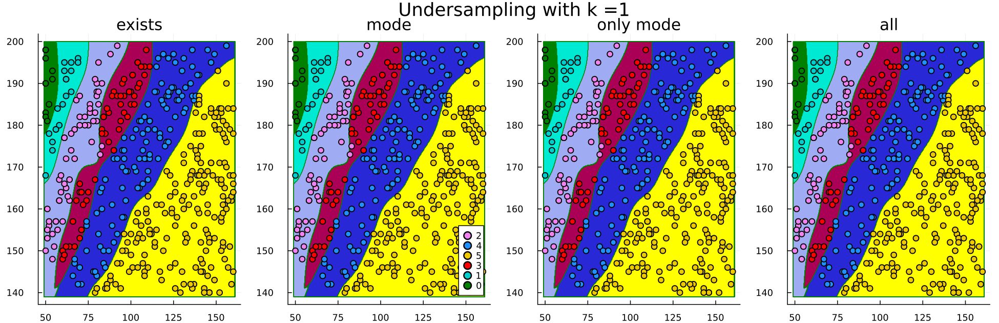

# Effect of ENN Hyperparameters


```julia
import Pkg;
Pkg.add(["Random", "CSV", "DataFrames", "MLJ", "Imbalance", 
         "ScientificTypes",  "Plots", "Measures", "HTTP"])

using Random
using CSV
using DataFrames
using MLJ
using Imbalance
using ScientificTypes
using Plots, Measures
using HTTP: download
```

## Loading Data
In this example, we will consider the [BMI dataset](https://www.kaggle.com/datasets/yasserh/bmidataset) found on Kaggle where the objective is to predict the BMI index of individuals given their gender, weight and height. 

`CSV` gives us the ability to easily read the dataset after it's downloaded as follows


```julia
download("https://raw.githubusercontent.com/JuliaAI/Imbalance.jl/dev/docs/src/examples/effect_of_k_enn/bmi.csv")

df = CSV.read("./bmi.csv", DataFrame)

# Display the first 5 rows with DataFrames
first(df, 5) |> pretty
```

    ┌─────────┬────────┬────────┬───────┐
    │ Gender  │ Height │ Weight │ Index │
    │ String7 │ Int64  │ Int64  │ Int64 │
    │ Textual │ Count  │ Count  │ Count │
    ├─────────┼────────┼────────┼───────┤
    │ Male    │ 174    │ 96     │ 4     │
    │ Male    │ 189    │ 87     │ 2     │
    │ Female  │ 185    │ 110    │ 4     │
    │ Female  │ 195    │ 104    │ 3     │
    │ Male    │ 149    │ 61     │ 3     │
    └─────────┴────────┴────────┴───────┘


We will drop the gender attribute for purposes of visualization and to have more options for the model.


```julia
select!(df, Not(:Gender)) |> pretty
```

## Coercing Data


```julia
ScientificTypes.schema(df)
```


    ┌────────┬──────────┬───────┐
    │ names  │ scitypes │ types │
    ├────────┼──────────┼───────┤
    │ Height │ Count    │ Int64 │
    │ Weight │ Count    │ Int64 │
    │ Index  │ Count    │ Int64 │
    └────────┴──────────┴───────┘


Weight and Height should be `Continuous` and Index should be an `OrderedFactor`


```julia
df = coerce(df,
            :Height => Continuous,
            :Weight => Continuous,
            :Index => OrderedFactor)
ScientificTypes.schema(df)
```


    ┌────────┬──────────────────┬─────────────────────────────────┐
    │ names  │ scitypes         │ types                           │
    ├────────┼──────────────────┼─────────────────────────────────┤
    │ Height │ Continuous       │ Float64                         │
    │ Weight │ Continuous       │ Float64                         │
    │ Index  │ OrderedFactor{6} │ CategoricalValue{Int64, UInt32} │
    └────────┴──────────────────┴─────────────────────────────────┘


## Unpacking Data

Both `MLJ` and the pure functional interface of `Imbalance` assume that the observations table `X` and target vector `y` are separate. We can accomplish that by using `unpack` from `MLJ`


```julia
y, X = unpack(df, ==(:Index); rng=123);
first(X, 5) |> pretty
```

    ┌────────────┬────────────┐
    │ Height     │ Weight     │
    │ Float64    │ Float64    │
    │ Continuous │ Continuous │
    ├────────────┼────────────┤
    │ 173.0      │ 82.0       │
    │ 187.0      │ 121.0      │
    │ 144.0      │ 145.0      │
    │ 156.0      │ 74.0       │
    │ 167.0      │ 151.0      │
    └────────────┴────────────┘


We will skip splitting the data since the main purpose of this tutorial is visualization.

## Undersampling

Before undersampling, let's check the balance of the data


```julia
checkbalance(y; ref="minority")
```

    0: ▇▇▇ 13 (100.0%) 
    1: ▇▇▇▇▇▇ 22 (169.2%) 
    3: ▇▇▇▇▇▇▇▇▇▇▇▇▇▇▇▇▇ 68 (523.1%) 
    2: ▇▇▇▇▇▇▇▇▇▇▇▇▇▇▇▇▇ 69 (530.8%) 
    4: ▇▇▇▇▇▇▇▇▇▇▇▇▇▇▇▇▇▇▇▇▇▇▇▇▇▇▇▇▇▇▇▇▇ 130 (1000.0%) 
    5: ▇▇▇▇▇▇▇▇▇▇▇▇▇▇▇▇▇▇▇▇▇▇▇▇▇▇▇▇▇▇▇▇▇▇▇▇▇▇▇▇▇▇▇▇▇▇▇▇▇▇ 198 (1523.1%) 


Let's use ENN undersampling to undersample the data. ENN undersamples the data by "cleaning it out" or in another words deleting any point that violates a certain condition. We can limit the number of points that are deleted by setting the `min_ratios` parameter. 

We will set `k=1` and `keep_condition="only mode"` which means that any point with a label that is not the only most common one amongst its 1-nearest neighbors will be deleted (i.e., must have same label as its nearest neighbor). By setting `min_ratios=1.0` we constraint that points should never be deleted form any class if it's ratio relative to the minority class will be less than `1.0`. This also means that no points will be deleted from the minority class.


```julia
X_under, y_under = enn_undersample(
	X,
	y;
	k = 1,
	keep_condition = "only mode",
	min_ratios=0.01,
	rng = 42,
)
```


    (448×2 DataFrame
     Row │ Height   Weight  
         │ Float64  Float64 
    ─────┼──────────────────
       1 │   173.0     82.0
       2 │   182.0     70.0
       3 │   156.0     52.0
       4 │   172.0     67.0
       5 │   162.0     58.0
       6 │   180.0     75.0
       7 │   190.0     83.0
       8 │   195.0     81.0
      ⋮  │    ⋮        ⋮
     442 │   196.0     50.0
     443 │   191.0     54.0
     444 │   185.0     52.0
     445 │   182.0     50.0
     446 │   198.0     50.0
     447 │   198.0     50.0
     448 │   181.0     51.0
            433 rows omitted, CategoricalArrays.CategoricalValue{Int64, UInt32}[2, 2, 2, 2, 2, 2, 2, 2, 2, 2  …  0, 0, 0, 0, 0, 0, 0, 0, 0, 0])


```julia
checkbalance(y_under; ref="minority")
```

    0: ▇▇▇ 11 (100.0%) 
    1: ▇▇▇▇▇ 19 (172.7%) 
    2: ▇▇▇▇▇▇▇▇▇▇▇▇▇▇▇ 56 (509.1%) 
    3: ▇▇▇▇▇▇▇▇▇▇▇▇▇▇▇ 58 (527.3%) 
    4: ▇▇▇▇▇▇▇▇▇▇▇▇▇▇▇▇▇▇▇▇▇▇▇▇▇▇▇▇▇▇ 115 (1045.5%) 
    5: ▇▇▇▇▇▇▇▇▇▇▇▇▇▇▇▇▇▇▇▇▇▇▇▇▇▇▇▇▇▇▇▇▇▇▇▇▇▇▇▇▇▇▇▇▇▇▇▇▇▇ 189 (1718.2%) 


This indeeds aligns with the desired ratios we have set earlier.

## Training the Model


Because we have scientific types setup, we can easily check what models will be able to train on our data. This should guarantee that the model we choose won't throw an error due to types after feeding it the data.


```julia
models(matching(X_under, y_under))
```


    53-element Vector{NamedTuple{(:name, :package_name, :is_supervised, :abstract_type, :deep_properties, :docstring, :fit_data_scitype, :human_name, :hyperparameter_ranges, :hyperparameter_types, :hyperparameters, :implemented_methods, :inverse_transform_scitype, :is_pure_julia, :is_wrapper, :iteration_parameter, :load_path, :package_license, :package_url, :package_uuid, :predict_scitype, :prediction_type, :reporting_operations, :reports_feature_importances, :supports_class_weights, :supports_online, :supports_training_losses, :supports_weights, :transform_scitype, :input_scitype, :target_scitype, :output_scitype)}}:
     (name = AdaBoostClassifier, package_name = MLJScikitLearnInterface, ... )
     (name = AdaBoostStumpClassifier, package_name = DecisionTree, ... )
     (name = BaggingClassifier, package_name = MLJScikitLearnInterface, ... )
     (name = BayesianLDA, package_name = MLJScikitLearnInterface, ... )
     (name = BayesianLDA, package_name = MultivariateStats, ... )
     (name = BayesianQDA, package_name = MLJScikitLearnInterface, ... )
     (name = BayesianSubspaceLDA, package_name = MultivariateStats, ... )
     (name = CatBoostClassifier, package_name = CatBoost, ... )
     (name = ConstantClassifier, package_name = MLJModels, ... )
     (name = DecisionTreeClassifier, package_name = BetaML, ... )
     ⋮
     (name = SGDClassifier, package_name = MLJScikitLearnInterface, ... )
     (name = SVC, package_name = LIBSVM, ... )
     (name = SVMClassifier, package_name = MLJScikitLearnInterface, ... )
     (name = SVMLinearClassifier, package_name = MLJScikitLearnInterface, ... )
     (name = SVMNuClassifier, package_name = MLJScikitLearnInterface, ... )
     (name = StableForestClassifier, package_name = SIRUS, ... )
     (name = StableRulesClassifier, package_name = SIRUS, ... )
     (name = SubspaceLDA, package_name = MultivariateStats, ... )
     (name = XGBoostClassifier, package_name = XGBoost, ... )


Let's go for an `SVM` from `LIBSVM`


```julia
import Pkg; Pkg.add("LIBSVM")
import LIBSVM;
```

        Updating registry at `~/.julia/registries/General`
        Updating git-repo `https://github.com/JuliaRegistries/General.git`
       Resolving package versions...
      No Changes to `~/Documents/GitHub/Imbalance.jl/docs/Project.toml`
      No Changes to `~/Documents/GitHub/Imbalance.jl/docs/Manifest.toml`


### Before Undersampling


```julia
# 1. Load the model
SVC = @load SVC pkg=LIBSVM

# 2. Instantiate it
model = SVC(kernel=LIBSVM.Kernel.RadialBasis, gamma=0.01) ## instance

# 3. Wrap it with the data in a machine
mach = machine(model, X, y)

# 4. fit the machine learning model
fit!(mach)
```

    import MLJLIBSVMInterface ✔


    ┌ Info: For silent loading, specify `verbosity=0`. 
    └ @ Main /Users/essam/.julia/packages/MLJModels/EkXIe/src/loading.jl:159
    ┌ Info: Training machine(SVC(kernel = RadialBasis, …), …).
    └ @ MLJBase /Users/essam/.julia/packages/MLJBase/ByFwA/src/machines.jl:492


    trained Machine; caches model-specific representations of data
      model: SVC(kernel = RadialBasis, …)
      args: 
        1:	Source @987 ⏎ Table{AbstractVector{Continuous}}
        2:	Source @104 ⏎ AbstractVector{OrderedFactor{6}}


### After Undersampling


```julia
# 3. Wrap it with the data in a machine
mach_under = machine(model, X_under, y_under)

# 4. fit the machine learning model
fit!(mach_under)
```

    ┌ Info: Training machine(SVC(kernel = RadialBasis, …), …).
    └ @ MLJBase /Users/essam/.julia/packages/MLJBase/ByFwA/src/machines.jl:492


    trained Machine; caches model-specific representations of data
      model: SVC(kernel = RadialBasis, …)
      args: 
        1:	Source @123 ⏎ Table{AbstractVector{Continuous}}
        2:	Source @423 ⏎ AbstractVector{OrderedFactor{6}}


## Plot Decision Boundaries

Construct ranges for each feature and consecutively a grid


```julia
height_range =
	range(minimum(X.Height) - 1, maximum(X.Height) + 1, length = 400)
weight_range =
range(minimum(X.Weight) - 1, maximum(X.Weight) + 1, length = 400)
grid_points = [(h, w) for h in height_range, w in weight_range]
```


    400×400 Matrix{Tuple{Float64, Float64}}:
     (139.0, 49.0)    (139.0, 49.2807)    (139.0, 49.5614)    …  (139.0, 161.0)
     (139.153, 49.0)  (139.153, 49.2807)  (139.153, 49.5614)     (139.153, 161.0)
     (139.306, 49.0)  (139.306, 49.2807)  (139.306, 49.5614)     (139.306, 161.0)
     (139.459, 49.0)  (139.459, 49.2807)  (139.459, 49.5614)     (139.459, 161.0)
     (139.612, 49.0)  (139.612, 49.2807)  (139.612, 49.5614)     (139.612, 161.0)
     (139.764, 49.0)  (139.764, 49.2807)  (139.764, 49.5614)  …  (139.764, 161.0)
     (139.917, 49.0)  (139.917, 49.2807)  (139.917, 49.5614)     (139.917, 161.0)
     (140.07, 49.0)   (140.07, 49.2807)   (140.07, 49.5614)      (140.07, 161.0)
     (140.223, 49.0)  (140.223, 49.2807)  (140.223, 49.5614)     (140.223, 161.0)
     (140.376, 49.0)  (140.376, 49.2807)  (140.376, 49.5614)     (140.376, 161.0)
     ⋮                                                        ⋱  
     (198.777, 49.0)  (198.777, 49.2807)  (198.777, 49.5614)     (198.777, 161.0)
     (198.93, 49.0)   (198.93, 49.2807)   (198.93, 49.5614)      (198.93, 161.0)
     (199.083, 49.0)  (199.083, 49.2807)  (199.083, 49.5614)     (199.083, 161.0)
     (199.236, 49.0)  (199.236, 49.2807)  (199.236, 49.5614)     (199.236, 161.0)
     (199.388, 49.0)  (199.388, 49.2807)  (199.388, 49.5614)  …  (199.388, 161.0)
     (199.541, 49.0)  (199.541, 49.2807)  (199.541, 49.5614)     (199.541, 161.0)
     (199.694, 49.0)  (199.694, 49.2807)  (199.694, 49.5614)     (199.694, 161.0)
     (199.847, 49.0)  (199.847, 49.2807)  (199.847, 49.5614)     (199.847, 161.0)
     (200.0, 49.0)    (200.0, 49.2807)    (200.0, 49.5614)       (200.0, 161.0)


Evaluate the grid with the machine before and after undersampling


```julia
grid_predictions =[
    predict(mach, Tables.table(reshape(collect(point), 1, 2)))[1] for
 	point in grid_points
 ]
 
grid_predictions_under = [
    predict(mach_under, Tables.table(reshape(collect(point), 1, 2)))[1] for
    point in grid_points
]
```

Make two contour plots using the grid predictions before and after oversampling


```julia
colors = [:green, :aqua, :violet, :red, :blue, :yellow]
p = contourf(weight_range, height_range, grid_predictions,
levels = 6, color = colors, colorbar = false)
p_under = contourf(weight_range, height_range,  grid_predictions_under,
levels = 6, color = colors, colorbar = false)
println()
```

    


```julia
labels = unique(y)
colors = Dict(
	0 => "green",
	1 => "cyan3",
	2 => "violet",
	3 => "red",
	4 => "dodgerblue",
	5 => "gold2",
)

for label in labels
	scatter!(p, X.Weight[y.==label], X.Height[y.==label],
		color = colors[label], label = label, markerstrokewidth = 1.5,
		title = "Before Undersampling")
	scatter!(p_under, X_under.Weight[y_under.==label], X_under.Height[y_under.==label],
		color = colors[label], label = label, markerstrokewidth = 1.5,
		title = "After Undersampling")
end

plot_res = plot(
	p,
	p_under,
	layout = (1, 2),
	xlabel = "Height",
	ylabel = "Width",
	size = (1200, 450),
	margin = 5mm, dpi = 200,
	legend = :outerbottomright,
)
savefig(plot_res, "./assets/ENN-before-after.png")

```


### Effect of $k$ Hyperparameter

Now let's study the cleaning effect as `k` increases for all types of keep conditions of undersampling.


```julia
anim = @animate for k ∈ 1:15
	conditions = ["exists", "mode", "only mode", "all"]
	plots = [plot() for _ in 1:4]
	data_list = []

	for i in 1:4

		X_under, y_under = enn_undersample(
			X,
			y;
			k = k,
			keep_condition = conditions[i],
			min_ratios = 0.01,
			rng = 42,
		)

		# fit machine
		mach_under = machine(model, X_under, y_under)
		fit!(mach_under, verbosity = 0)

		# grid predictions
		grid_predictions_under = [
			predict(mach_under, Tables.table(reshape(collect(point), 1, 2)))[1] for
			point in grid_points
		]

		# plot
		colors = [:green, :aqua, :violet, :red, :blue, :yellow]
		contourf!(plots[i], weight_range, height_range, grid_predictions_under,
			levels = 6, color = colors, colorbar = false)

		colors = Dict(
			0 => "green",
			1 => "cyan3",
			2 => "violet",
			3 => "red",
			4 => "dodgerblue",
			5 => "gold2",
		)
		for label in labels
			scatter!(plots[i], X_under.Weight[y_under.==label],
				X_under.Height[y_under.==label],
				color = colors[label], label = label, markerstrokewidth = 1.5,
				title = "$(conditions[i])", legend = ((i == 2) ? :bottomright : :none))
		end
		plot!(
			plots[1], plots[2], plots[3], plots[4],
			layout = (1, 4),
			size = (1300, 420),
			plot_title = "Undersampling with k =$k",
		)
	end
	plot!(dpi = 150)
end

```


```julia
gif(anim, "./assets/enn-k-animation.gif", fps=1)
```



As we can see, the most constraining condition is `all`. It deletes any point where the label is different than any of the nearest `k` neighbors which also explains why it's the most sensitive to 
the hyperparameter `k`.


