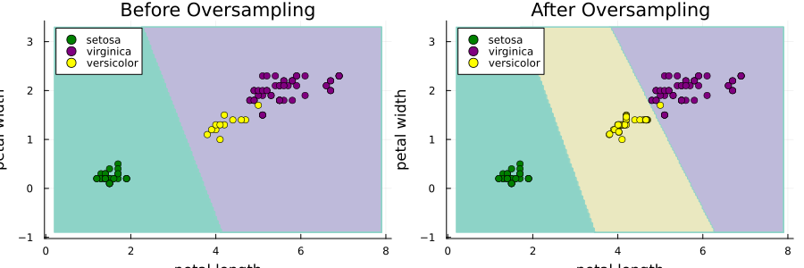
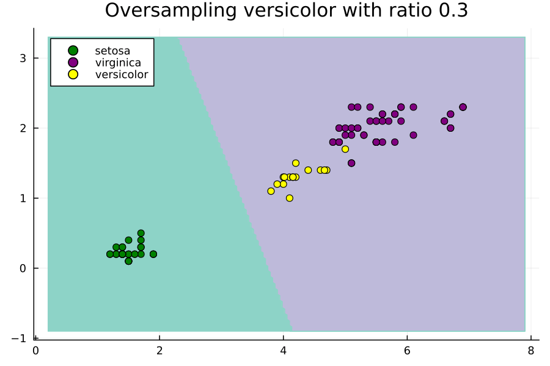

# Imports


```julia
using Random
using CSV
using DataFrames
using MLJ
using ScientificTypes
using Imbalance
using Plots
```

## Loading Data

Let's load the Iris dataset, the objective of this dataset is to predict the type of flower as one of "virginica", "versicolor" and "setosa" using its sepal and petal length and width.

We don't need to so from a CSV file this time because `MLJ` has a macro for loading it already! The only difference is that we will need to explictly convert it to a dataframe as `MLJ` loads it as a named tuple of vectors.


```julia
X, y = @load_iris
X = DataFrame(X)
first(X, 5) |> pretty
```

    ┌──────────────┬─────────────┬──────────────┬─────────────┐
    │ sepal_length │ sepal_width │ petal_length │ petal_width │
    │ Float64      │ Float64     │ Float64      │ Float64     │
    │ Continuous   │ Continuous  │ Continuous   │ Continuous  │
    ├──────────────┼─────────────┼──────────────┼─────────────┤
    │ 5.1          │ 3.5         │ 1.4          │ 0.2         │
    │ 4.9          │ 3.0         │ 1.4          │ 0.2         │
    │ 4.7          │ 3.2         │ 1.3          │ 0.2         │
    │ 4.6          │ 3.1         │ 1.5          │ 0.2         │
    │ 5.0          │ 3.6         │ 1.4          │ 0.2         │
    └──────────────┴─────────────┴──────────────┴─────────────┘


Our purpose for this tutorial is primarily visuallization. Thus, let's select two of the continuous features only to work with. It's known that the sepal length and width play a much bigger role in classifying the type of flower so let's keep those only.


```julia
X = select(X, :petal_width, :petal_length)
first(X, 5) |> pretty
```

    ┌─────────────┬──────────────┐
    │ petal_width │ petal_length │
    │ Float64     │ Float64      │
    │ Continuous  │ Continuous   │
    ├─────────────┼──────────────┤
    │ 0.2         │ 1.4          │
    │ 0.2         │ 1.4          │
    │ 0.2         │ 1.3          │
    │ 0.2         │ 1.5          │
    │ 0.2         │ 1.4          │
    └─────────────┴──────────────┘


## Coercing Data


```julia
ScientificTypes.schema(X)
```


    ┌──────────────┬────────────┬─────────┐
    │ names        │ scitypes   │ types   │
    ├──────────────┼────────────┼─────────┤
    │ petal_width  │ Continuous │ Float64 │
    │ petal_length │ Continuous │ Float64 │
    └──────────────┴────────────┴─────────┘


Things look good, no coercion is needed.


## Oversampling

Iris, by default has no imbalance problem


```julia
checkbalance(y)
```

To simulate that there is a balance problem, we will consider a random sample of 100 observations. A random sample does not guarantee perserving the proportion of classes; in this, we actually set the seed to get a very unlikely random sample that suffers from moderate imbalance.


```julia
Random.seed!(803429)
subset_indices = rand(1:size(X, 1), 100)
X, y = X[subset_indices, :], y[subset_indices]
checkbalance(y)
```

We will treat this as our training set going forward so we don't need to partition. Now let's oversample it with SMOTE.


```julia
Xover, yover = smote(X, y; k=5, ratios=Dict("versicolor" => 0.7), rng=42)
checkbalance(yover)
```

## Training the Model


```julia
models(matching(Xover, yover))
```


    53-element Vector{NamedTuple{(:name, :package_name, :is_supervised, :abstract_type, :deep_properties, :docstring, :fit_data_scitype, :human_name, :hyperparameter_ranges, :hyperparameter_types, :hyperparameters, :implemented_methods, :inverse_transform_scitype, :is_pure_julia, :is_wrapper, :iteration_parameter, :load_path, :package_license, :package_url, :package_uuid, :predict_scitype, :prediction_type, :reporting_operations, :reports_feature_importances, :supports_class_weights, :supports_online, :supports_training_losses, :supports_weights, :transform_scitype, :input_scitype, :target_scitype, :output_scitype)}}:
     (name = AdaBoostClassifier, package_name = MLJScikitLearnInterface, ... )
     (name = AdaBoostStumpClassifier, package_name = DecisionTree, ... )
     (name = BaggingClassifier, package_name = MLJScikitLearnInterface, ... )
     (name = BayesianLDA, package_name = MLJScikitLearnInterface, ... )
     (name = BayesianLDA, package_name = MultivariateStats, ... )
     (name = BayesianQDA, package_name = MLJScikitLearnInterface, ... )
     (name = BayesianSubspaceLDA, package_name = MultivariateStats, ... )
     (name = CatBoostClassifier, package_name = CatBoost, ... )
     (name = ConstantClassifier, package_name = MLJModels, ... )
     (name = DecisionTreeClassifier, package_name = BetaML, ... )
     ⋮
     (name = SGDClassifier, package_name = MLJScikitLearnInterface, ... )
     (name = SVC, package_name = LIBSVM, ... )
     (name = SVMClassifier, package_name = MLJScikitLearnInterface, ... )
     (name = SVMLinearClassifier, package_name = MLJScikitLearnInterface, ... )
     (name = SVMNuClassifier, package_name = MLJScikitLearnInterface, ... )
     (name = StableForestClassifier, package_name = SIRUS, ... )
     (name = StableRulesClassifier, package_name = SIRUS, ... )
     (name = SubspaceLDA, package_name = MultivariateStats, ... )
     (name = XGBoostClassifier, package_name = XGBoost, ... )


Let's go for an SVM


```julia
import Pkg;
Pkg.add("MLJLIBSVMInterface");
```

       Resolving package versions...
      No Changes to `~/Documents/GitHub/Imbalance.jl/Project.toml`
      No Changes to `~/Documents/GitHub/Imbalance.jl/Manifest.toml`


### Before Oversampling


```julia
# 1. Load the model
SVC = @load SVC pkg = LIBSVM

# 2. Instantiate it (γ=0.01 is intentional)
model = SVC(gamma=0.01)

# 3. Wrap it with the data in a machine
mach = machine(model, X, y)

# 4. fit the machine learning model
fit!(mach)
```

    import MLJLIBSVMInterface

    ┌ Info: For silent loading, specify `verbosity=0`. 
    └ @ Main /Users/essam/.julia/packages/MLJModels/7apZ3/src/loading.jl:159
    ┌ Info: Training machine(SVC(kernel = RadialBasis, …), …).
    └ @ MLJBase /Users/essam/.julia/packages/MLJBase/0rn2V/src/machines.jl:492


    trained Machine; caches model-specific representations of data
      model: SVC(kernel = RadialBasis, …)
      args: 
        1:	Source @625 ⏎ Table{AbstractVector{Continuous}}
        2:	Source @365 ⏎ AbstractVector{Multiclass{3}}


### After Oversampling


```julia
# 3. Wrap it with the data in a machine
mach_over = machine(model, Xover, yover)

# 4. fit the machine learning model
fit!(mach_over)
```

    ┌ Info: Training machine(SVC(kernel = RadialBasis, …), …).
    └ @ MLJBase /Users/essam/.julia/packages/MLJBase/0rn2V/src/machines.jl:492


    trained Machine; caches model-specific representations of data
      model: SVC(kernel = RadialBasis, …)
      args: 
        1:	Source @136 ⏎ Table{AbstractVector{Continuous}}
        2:	Source @492 ⏎ AbstractVector{Multiclass{3}}


## Plot Decision Boundaries

Construct ranges for each feature and consecutively a grid


```julia
petal_width_range =
	range(minimum(X.petal_width) - 1, maximum(X.petal_width) + 1, length = 200)
petal_length_range =
	range(minimum(X.petal_length) - 1, maximum(X.petal_length) + 1, length = 200)
grid_points = [(pw, pl) for pw in petal_width_range, pl in petal_length_range]
```


    200×200 Matrix{Tuple{Float64, Float64}}:
     (-0.9, 0.2)       (-0.9, 0.238693)       …  (-0.9, 7.9)
     (-0.878894, 0.2)  (-0.878894, 0.238693)     (-0.878894, 7.9)
     (-0.857789, 0.2)  (-0.857789, 0.238693)     (-0.857789, 7.9)
     (-0.836683, 0.2)  (-0.836683, 0.238693)     (-0.836683, 7.9)
     (-0.815578, 0.2)  (-0.815578, 0.238693)     (-0.815578, 7.9)
     (-0.794472, 0.2)  (-0.794472, 0.238693)  …  (-0.794472, 7.9)
     (-0.773367, 0.2)  (-0.773367, 0.238693)     (-0.773367, 7.9)
     (-0.752261, 0.2)  (-0.752261, 0.238693)     (-0.752261, 7.9)
     (-0.731156, 0.2)  (-0.731156, 0.238693)     (-0.731156, 7.9)
     (-0.71005, 0.2)   (-0.71005, 0.238693)      (-0.71005, 7.9)
     ⋮                                        ⋱  
     (3.13116, 0.2)    (3.13116, 0.238693)       (3.13116, 7.9)
     (3.15226, 0.2)    (3.15226, 0.238693)       (3.15226, 7.9)
     (3.17337, 0.2)    (3.17337, 0.238693)       (3.17337, 7.9)
     (3.19447, 0.2)    (3.19447, 0.238693)       (3.19447, 7.9)
     (3.21558, 0.2)    (3.21558, 0.238693)    …  (3.21558, 7.9)
     (3.23668, 0.2)    (3.23668, 0.238693)       (3.23668, 7.9)
     (3.25779, 0.2)    (3.25779, 0.238693)       (3.25779, 7.9)
     (3.27889, 0.2)    (3.27889, 0.238693)       (3.27889, 7.9)
     (3.3, 0.2)        (3.3, 0.238693)           (3.3, 7.9)


Evaluate the grid with the machine before and after oversampling


```julia
grid_predictions =[
    predict(mach, Tables.table(reshape(collect(point), 1, 2)))[1] for
 	point in grid_points
 ]
grid_predictions_over = [
    predict(mach_over, Tables.table(reshape(collect(point), 1, 2)))[1] for
    point in grid_points
]
```


    200×200 CategoricalArrays.CategoricalArray{String,2,UInt32}:
     "setosa"  "setosa"  "setosa"  "setosa"  …  "virginica"  "virginica"
     "setosa"  "setosa"  "setosa"  "setosa"     "virginica"  "virginica"
     "setosa"  "setosa"  "setosa"  "setosa"     "virginica"  "virginica"
     "setosa"  "setosa"  "setosa"  "setosa"     "virginica"  "virginica"
     "setosa"  "setosa"  "setosa"  "setosa"     "virginica"  "virginica"
     "setosa"  "setosa"  "setosa"  "setosa"  …  "virginica"  "virginica"
     "setosa"  "setosa"  "setosa"  "setosa"     "virginica"  "virginica"
     "setosa"  "setosa"  "setosa"  "setosa"     "virginica"  "virginica"
     "setosa"  "setosa"  "setosa"  "setosa"     "virginica"  "virginica"
     "setosa"  "setosa"  "setosa"  "setosa"     "virginica"  "virginica"
     ⋮                                       ⋱               
     "setosa"  "setosa"  "setosa"  "setosa"     "virginica"  "virginica"
     "setosa"  "setosa"  "setosa"  "setosa"     "virginica"  "virginica"
     "setosa"  "setosa"  "setosa"  "setosa"     "virginica"  "virginica"
     "setosa"  "setosa"  "setosa"  "setosa"     "virginica"  "virginica"
     "setosa"  "setosa"  "setosa"  "setosa"  …  "virginica"  "virginica"
     "setosa"  "setosa"  "setosa"  "setosa"     "virginica"  "virginica"
     "setosa"  "setosa"  "setosa"  "setosa"     "virginica"  "virginica"
     "setosa"  "setosa"  "setosa"  "setosa"     "virginica"  "virginica"
     "setosa"  "setosa"  "setosa"  "setosa"     "virginica"  "virginica"


Make two contour plots using the grid predictions before and after oversampling


```julia
p = contourf(petal_length_range, petal_width_range, grid_predictions,
    levels=3, color=:Set3_3, colorbar=false)
p_over = contourf(petal_length_range, petal_width_range, grid_predictions_over,
    levels=3, color=:Set3_3, colorbar=false)
```

Scatter plot the data before and after oversampling


```julia
labels = unique(y)
colors = Dict("setosa"=> "green", "versicolor" = > "yellow",
              "virginica"=> "purple")

for label in labels
scatter!(p, X.petal_length[y. == label], X.petal_width[y. == label],
         color=colors[label], label=label,
         title="Before Oversampling")
scatter!(p_over, Xover.petal_length[yover. == label], Xover.petal_width[yover. == label],
         color=colors[label], label=label,
         title="After Oversampling")
end

plot_res = plot(p, p_over, layout=(1, 2), xlabel="petal length",
                ylabel="petal width", size=(900, 300))
savefig(plot_res, "./visuals/before-after-smote.png")

```


    "/Users/essam/Documents/GitHub/Imbalance.jl/examples/visuals/before-after-smote.png"





Notice how the minority class was completely ignore prior to oversampling. Not all models and hyperparameter settings are this delicate to class imbalance.


## Effect of Ratios Hyperparameter

Now let's strudy the effect of the ratios hyperparameter. We will do this through an animated plot.


```julia
anim = @animate for versicolor_ratio ∈ 0.3:0.01:2
	# oversample
	Xover, yover =
		smote(X, y; k = 5, ratios = Dict("versicolor" => versicolor_ratio), rng = 42)

	# fit machine
	model = SVC(gamma = 0.01)
	mach_over = machine(model, Xover, yover)
	fit!(mach_over, verbosity = 0)

	# grid predictions
	grid_predictions_over = [
		predict(mach_over, Tables.table(reshape(collect(point), 1, 2)))[1] for
		point in grid_points
	]

	# plot
	p_over = contourf(petal_length_range, petal_width_range, grid_predictions_over,
		levels = 3, color = :Set3_3, colorbar = false)
	for label in labels
		scatter!(p_over, Xover.petal_length[yover.==label],
			Xover.petal_width[yover.==label],
			color = colors[label], label = label,
			title = "Oversampling versicolor with ratio $versicolor_ratio")
	end
	plot!(dpi = 150)
end
```


    Animation("/var/folders/nq/f_nplzp52qx_hrrhyg44xf4c0000gn/T/jl_ZGJtxs", ["000001.png", "000002.png", "000003.png", "000004.png", "000005.png", "000006.png", "000007.png", "000008.png", "000009.png", "000010.png"  …  "000162.png", "000163.png", "000164.png", "000165.png", "000166.png", "000167.png", "000168.png", "000169.png", "000170.png", "000171.png"])


```julia
gif(anim, "./visuals/rose-animation.gif", fps=6)
println()
```

    ┌ Info: Saved animation to /Users/essam/Documents/GitHub/Imbalance.jl/examples/visuals/rose-animation.gif
    └ @ Plots /Users/essam/.julia/packages/Plots/3BCH5/src/animation.jl:156





Notice how setting ratios greedly can lead to overfitting.


