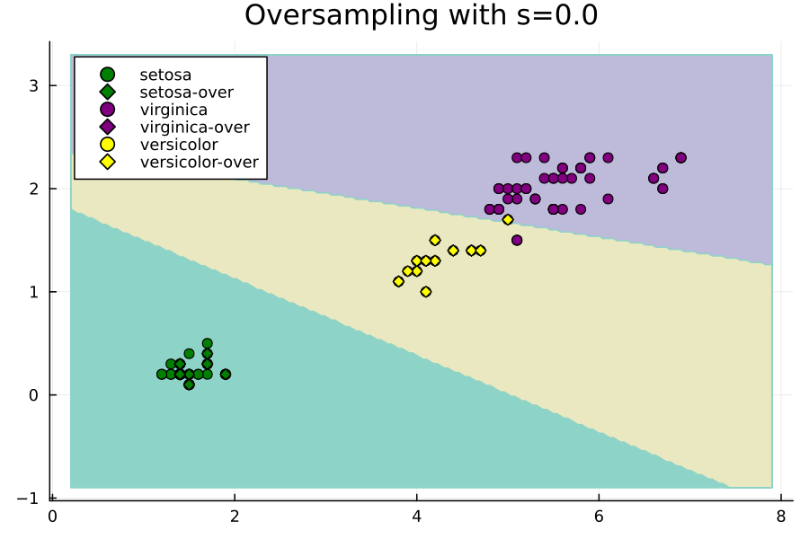

# From RandomOversampling to ROSE


```julia

import Pkg;
Pkg.add(["Random", "CSV", "DataFrames", "MLJ", "Imbalance",
         "ScientificTypes", "Plots", "Measures", "HTTP"])

using Random
using CSV
using DataFrames
using MLJ
using ScientificTypes
using Imbalance
using Plots, Measures
using HTTP: download
```

## Loading Data
Let's load the Iris dataset, the objective of this dataset is to predict the type of flower as one of "virginica", "versicolor" and "setosa" using its sepal and petal length and width. 

We don't need to so from a CSV file this time because `MLJ` has a macro for loading it already! The only difference is that we will need to explictly convert it to a dataframe as `MLJ` loads it as a named tuple of vectors.


```julia
X, y = @load_iris
X = DataFrame(X)
first(X, 5) |> pretty
```

    ┌──────────────┬─────────────┬──────────────┬─────────────┐
    │ sepal_length │ sepal_width │ petal_length │ petal_width │
    │ Float64      │ Float64     │ Float64      │ Float64     │
    │ Continuous   │ Continuous  │ Continuous   │ Continuous  │
    ├──────────────┼─────────────┼──────────────┼─────────────┤
    │ 5.1          │ 3.5         │ 1.4          │ 0.2         │
    │ 4.9          │ 3.0         │ 1.4          │ 0.2         │
    │ 4.7          │ 3.2         │ 1.3          │ 0.2         │
    │ 4.6          │ 3.1         │ 1.5          │ 0.2         │
    │ 5.0          │ 3.6         │ 1.4          │ 0.2         │
    └──────────────┴─────────────┴──────────────┴─────────────┘


Our purpose for this tutorial is primarily visuallization. Thus, let's select two of the continuous features only to work with. It's known that the sepal length and width play a much bigger role in classifying the type of flower so let's keep those only.


```julia
X = select(X, :petal_width, :petal_length)
first(X, 5) |> pretty
```

    ┌─────────────┬──────────────┐
    │ petal_width │ petal_length │
    │ Float64     │ Float64      │
    │ Continuous  │ Continuous   │
    ├─────────────┼──────────────┤
    │ 0.2         │ 1.4          │
    │ 0.2         │ 1.4          │
    │ 0.2         │ 1.3          │
    │ 0.2         │ 1.5          │
    │ 0.2         │ 1.4          │
    └─────────────┴──────────────┘


## Coercing Data


```julia
ScientificTypes.schema(X)
```


    ┌──────────────┬────────────┬─────────┐
    │ names        │ scitypes   │ types   │
    ├──────────────┼────────────┼─────────┤
    │ petal_width  │ Continuous │ Float64 │
    │ petal_length │ Continuous │ Float64 │
    └──────────────┴────────────┴─────────┘


Things look good, no coercion is needed.

## Oversampling

Iris, by default has no imbalance problem


```julia
checkbalance(y)
```

    virginica:  ▇▇▇▇▇▇▇▇▇▇▇▇▇▇▇▇▇▇▇▇▇▇▇▇▇▇▇▇▇▇▇▇▇▇▇▇▇▇▇▇▇▇▇▇▇▇▇▇▇▇ 50 (100.0%) 
    setosa:     ▇▇▇▇▇▇▇▇▇▇▇▇▇▇▇▇▇▇▇▇▇▇▇▇▇▇▇▇▇▇▇▇▇▇▇▇▇▇▇▇▇▇▇▇▇▇▇▇▇▇ 50 (100.0%) 
    versicolor: ▇▇▇▇▇▇▇▇▇▇▇▇▇▇▇▇▇▇▇▇▇▇▇▇▇▇▇▇▇▇▇▇▇▇▇▇▇▇▇▇▇▇▇▇▇▇▇▇▇▇ 50 (100.0%) 


To simulate that there is a balance problem, we will consider a random sample of 100 observations. A random sample does not guarantee perserving the proportion of classes; in this, we actually set the seed to get a very unlikely random sample that suffers from strong imbalance.


```julia
Random.seed!(803429)
subset_indices = rand(1:size(X, 1), 100)
X, y = X[subset_indices, :], y[subset_indices]
checkbalance(y)         # comes from Imbalance
```

    versicolor: ▇▇▇▇▇▇▇▇▇▇▇ 12 (22.6%) 
    setosa:     ▇▇▇▇▇▇▇▇▇▇▇▇▇▇▇▇▇▇▇▇▇▇▇▇▇▇▇▇▇▇▇▇▇ 35 (66.0%) 
    virginica:  ▇▇▇▇▇▇▇▇▇▇▇▇▇▇▇▇▇▇▇▇▇▇▇▇▇▇▇▇▇▇▇▇▇▇▇▇▇▇▇▇▇▇▇▇▇▇▇▇▇▇ 53 (100.0%) 


We will treat this as our training set going forward so we don't need to partition. Now let's oversample it with ROSE.


```julia
Xover, yover = rose(X, y; s=0.3, ratios=Dict("versicolor" => 1.0, "setosa"=>1.0))
checkbalance(yover)
```

    Progress:  67%|███████████████████████████▍             |  ETA: 0:00:00
    

    virginica:  ▇▇▇▇▇▇▇▇▇▇▇▇▇▇▇▇▇▇▇▇▇▇▇▇▇▇▇▇▇▇▇▇▇▇▇▇▇▇▇▇▇▇▇▇▇▇▇▇▇▇ 53 (100.0%) 
    setosa:     ▇▇▇▇▇▇▇▇▇▇▇▇▇▇▇▇▇▇▇▇▇▇▇▇▇▇▇▇▇▇▇▇▇▇▇▇▇▇▇▇▇▇▇▇▇▇▇▇▇▇ 53 (100.0%) 
    versicolor: ▇▇▇▇▇▇▇▇▇▇▇▇▇▇▇▇▇▇▇▇▇▇▇▇▇▇▇▇▇▇▇▇▇▇▇▇▇▇▇▇▇▇▇▇▇▇▇▇▇▇ 53 (100.0%) 


## Training the Model


```julia
models(matching(Xover, yover))
```


    53-element Vector{NamedTuple{(:name, :package_name, :is_supervised, :abstract_type, :deep_properties, :docstring, :fit_data_scitype, :human_name, :hyperparameter_ranges, :hyperparameter_types, :hyperparameters, :implemented_methods, :inverse_transform_scitype, :is_pure_julia, :is_wrapper, :iteration_parameter, :load_path, :package_license, :package_url, :package_uuid, :predict_scitype, :prediction_type, :reporting_operations, :reports_feature_importances, :supports_class_weights, :supports_online, :supports_training_losses, :supports_weights, :transform_scitype, :input_scitype, :target_scitype, :output_scitype)}}:
     (name = AdaBoostClassifier, package_name = MLJScikitLearnInterface, ... )
     (name = AdaBoostStumpClassifier, package_name = DecisionTree, ... )
     (name = BaggingClassifier, package_name = MLJScikitLearnInterface, ... )
     (name = BayesianLDA, package_name = MLJScikitLearnInterface, ... )
     (name = BayesianLDA, package_name = MultivariateStats, ... )
     (name = BayesianQDA, package_name = MLJScikitLearnInterface, ... )
     (name = BayesianSubspaceLDA, package_name = MultivariateStats, ... )
     (name = CatBoostClassifier, package_name = CatBoost, ... )
     (name = ConstantClassifier, package_name = MLJModels, ... )
     (name = DecisionTreeClassifier, package_name = BetaML, ... )
     ⋮
     (name = SGDClassifier, package_name = MLJScikitLearnInterface, ... )
     (name = SVC, package_name = LIBSVM, ... )
     (name = SVMClassifier, package_name = MLJScikitLearnInterface, ... )
     (name = SVMLinearClassifier, package_name = MLJScikitLearnInterface, ... )
     (name = SVMNuClassifier, package_name = MLJScikitLearnInterface, ... )
     (name = StableForestClassifier, package_name = SIRUS, ... )
     (name = StableRulesClassifier, package_name = SIRUS, ... )
     (name = SubspaceLDA, package_name = MultivariateStats, ... )
     (name = XGBoostClassifier, package_name = XGBoost, ... )


Let's go for a [Decision Tree](https://alan-turing-institute.github.io/MLJ.jl/dev/models/DecisionTreeClassifier_DecisionTree/#DecisionTreeClassifier_DecisionTree). This is just like the normal perceptron but it learns the separating hyperplane in a higher dimensional space using the kernel trick so that it corresponds to a nonlinear separating hypersurface in the original space. This isn't necessarily helpful in our case, but just to experiment.


```julia
import Pkg; Pkg.add("MultivariateStats")
```

### Before Oversampling


```julia
# 1. Load the model
BayesianLDA = @load BayesianLDA pkg=MultivariateStats

# 2. Instantiate it 
model = BayesianLDA()

# 3. Wrap it with the data in a machine
mach = machine(model, X, y)

# 4. fit the machine learning model
fit!(mach, verbosity=0)
```

### After Oversampling


```julia
# 3. Wrap it with the data in a machine
mach_over = machine(model, Xover, yover)

# 4. fit the machine learning model
fit!(mach_over, verbosity=0)
```

## Plot Decision Boundaries

Construct ranges for each feature and consecutively a grid


```julia
petal_width_range =
	range(minimum(X.petal_width) - 1, maximum(X.petal_width) + 1, length = 200)
petal_length_range =
	range(minimum(X.petal_length) - 1, maximum(X.petal_length) + 1, length = 200)
grid_points = [(pw, pl) for pw in petal_width_range, pl in petal_length_range]

```


    200×200 Matrix{Tuple{Float64, Float64}}:
     (-0.9, 0.2)       (-0.9, 0.238693)       …  (-0.9, 7.9)
     (-0.878894, 0.2)  (-0.878894, 0.238693)     (-0.878894, 7.9)
     (-0.857789, 0.2)  (-0.857789, 0.238693)     (-0.857789, 7.9)
     (-0.836683, 0.2)  (-0.836683, 0.238693)     (-0.836683, 7.9)
     (-0.815578, 0.2)  (-0.815578, 0.238693)     (-0.815578, 7.9)
     (-0.794472, 0.2)  (-0.794472, 0.238693)  …  (-0.794472, 7.9)
     (-0.773367, 0.2)  (-0.773367, 0.238693)     (-0.773367, 7.9)
     (-0.752261, 0.2)  (-0.752261, 0.238693)     (-0.752261, 7.9)
     (-0.731156, 0.2)  (-0.731156, 0.238693)     (-0.731156, 7.9)
     (-0.71005, 0.2)   (-0.71005, 0.238693)      (-0.71005, 7.9)
     ⋮                                        ⋱  
     (3.13116, 0.2)    (3.13116, 0.238693)       (3.13116, 7.9)
     (3.15226, 0.2)    (3.15226, 0.238693)       (3.15226, 7.9)
     (3.17337, 0.2)    (3.17337, 0.238693)       (3.17337, 7.9)
     (3.19447, 0.2)    (3.19447, 0.238693)       (3.19447, 7.9)
     (3.21558, 0.2)    (3.21558, 0.238693)    …  (3.21558, 7.9)
     (3.23668, 0.2)    (3.23668, 0.238693)       (3.23668, 7.9)
     (3.25779, 0.2)    (3.25779, 0.238693)       (3.25779, 7.9)
     (3.27889, 0.2)    (3.27889, 0.238693)       (3.27889, 7.9)
     (3.3, 0.2)        (3.3, 0.238693)           (3.3, 7.9)


Evaluate the grid with the machine before and after oversampling


```julia
grid_predictions = [
	predict_mode(mach, Tables.table(reshape(collect(point), 1, 2)))[1] for
	point in grid_points
]
grid_predictions_over = [
	predict_mode(mach_over, Tables.table(reshape(collect(point), 1, 2)))[1] for
	point in grid_points
]
```


    200×200 CategoricalArrays.CategoricalArray{String,2,UInt32}:
     "setosa"     "setosa"     "setosa"     …  "versicolor"  "versicolor"
     "setosa"     "setosa"     "setosa"        "versicolor"  "versicolor"
     "setosa"     "setosa"     "setosa"        "versicolor"  "versicolor"
     "setosa"     "setosa"     "setosa"        "versicolor"  "versicolor"
     "setosa"     "setosa"     "setosa"        "versicolor"  "versicolor"
     "setosa"     "setosa"     "setosa"     …  "versicolor"  "versicolor"
     "setosa"     "setosa"     "setosa"        "versicolor"  "versicolor"
     "setosa"     "setosa"     "setosa"        "versicolor"  "versicolor"
     "setosa"     "setosa"     "setosa"        "versicolor"  "versicolor"
     "setosa"     "setosa"     "setosa"        "versicolor"  "versicolor"
     ⋮                                      ⋱                
     "virginica"  "virginica"  "virginica"     "virginica"   "virginica"
     "virginica"  "virginica"  "virginica"     "virginica"   "virginica"
     "virginica"  "virginica"  "virginica"     "virginica"   "virginica"
     "virginica"  "virginica"  "virginica"     "virginica"   "virginica"
     "virginica"  "virginica"  "virginica"  …  "virginica"   "virginica"
     "virginica"  "virginica"  "virginica"     "virginica"   "virginica"
     "virginica"  "virginica"  "virginica"     "virginica"   "virginica"
     "virginica"  "virginica"  "virginica"     "virginica"   "virginica"
     "virginica"  "virginica"  "virginica"     "virginica"   "virginica"


Make two contour plots using the grid predictions before and after oversampling


```julia
p = contourf(petal_length_range, petal_width_range, grid_predictions,
	levels = 3, color = :Set3_3, colorbar = false)
p_over = contourf(petal_length_range, petal_width_range, grid_predictions_over,
	levels = 3, color = :Set3_3, colorbar = false)
println()
```

    


Scatter plot the data before and after oversampling


```julia
old_count = size(X, 1)
labels = unique(y)
colors = Dict("setosa" => "green", "versicolor" => "yellow",
	"virginica" => "purple")

for label in labels
	scatter!(p, X.petal_length[y.==label], X.petal_width[y.==label],
		color = colors[label], label = label,
		title = "Before Oversampling")
	scatter!(p_over, X.petal_length[y.==label], X.petal_width[y.==label],
		color = colors[label], label = label,
		title = "After Oversampling")
	# find new points only and plot with different shape
	scatter!(p_over, Xover.petal_length[old_count+1:end][yover[old_count+1:end].==label],
		Xover.petal_width[old_count+1:end][yover[old_count+1:end].==label],
		color = colors[label], label = label*"-over", markershape = :diamond,
		title = "After Oversampling")
end

plot_res = plot(
	p,
	p_over,
	layout = (1, 2),
	xlabel = "petal length",
	ylabel = "petal width",
	size = (900, 300),
	margin = 5mm, dpi = 200
)
savefig(plot_res, "./assets/ROSE-before-after.png")
```


## Effect of Increasing `s`


```julia
anim = @animate for s ∈ 0:0.03:6.0
	# oversample
	Xover, yover =
		rose(X, y; s = s, ratios = Dict("setosa" => 1.0, "versicolor" => 1.0), rng = 42)

	model = BayesianLDA()
	mach_over = machine(model, Xover, yover)
	fit!(mach_over, verbosity = 0)

	# grid predictions
	grid_predictions_over = [
		predict_mode(mach_over, Tables.table(reshape(collect(point), 1, 2)))[1] for
		point in grid_points
	]

	p_over = contourf(petal_length_range, petal_width_range, grid_predictions_over,
		levels = 3, color = :Set3_3, colorbar = false)

	old_count = size(X, 1)
	for label in labels
		scatter!(p_over, X.petal_length[y.==label], X.petal_width[y.==label],
			color = colors[label], label = label,
			title = "Oversampling with s=$s")
		# find new points only and plot with different shape
		scatter!(p_over,
			Xover.petal_length[old_count+1:end][yover[old_count+1:end].==label],
			Xover.petal_width[old_count+1:end][yover[old_count+1:end].==label],
			color = colors[label], label = label * "-over", markershape = :diamond,
			title = "Oversampling with s=$s")
	end
	plot!(dpi = 150)
end

```


```julia
gif(anim, "./assets/rose-animation.gif", fps=6)
println()
```



As we can see, the larger `s` is the more spread out are the oversampled points. This is expected because what ROSE does is oversample by sampling from the distribution that corresponds to placing Gaussians on the existing points and `s` is a hyperparameter proportional to the bandwidth of the Gaussians. When `s=0` the only points that can be generated lie on top of others; i.e., ROSE becomes equivalent to random oversampling

The decision boundary is mainly unstable because we used a small number of epochs with the perceptron to generate this animation. It still took plenty of time.


